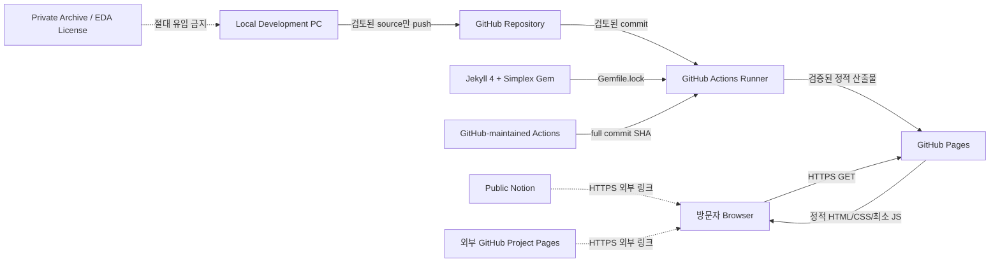

# Security Architecture

## 목적과 범위

이 문서는 공개 정적 Engineering Portfolio의 방어적 구조를 정의한다. 목표는
위험을 줄이고 검증 가능한 통제를 유지하는 것이며, 완전한 침해 방지나 DDoS
완전 차단을 보장하지 않는다.

현재 확인일은 2026-07-31(Asia/Seoul)이다. 루트 Pages 저장소와 기존 배포,
HTTP→HTTPS 전환, TLS 1.3, 새 Jekyll 산출물의 로컬 검사를 확인했다. GitHub 계정과
로컬 기기처럼 이 작업에서 원격 검증할 수 없는 통제는 `BLOCKED`로 유지한다.

## 최소 아키텍처



다음 구성은 추가하지 않는다.

- 서버 데이터베이스, 회원가입, 로그인, 결제, 파일 업로드
- 사용자 댓글·HTML 입력, 관리자 페이지, 자체 Contact backend
- Firebase, Supabase, 별도 REST/GraphQL API, WebSocket, Serverless Function
- Analytics·광고·채팅·외부 Form 스크립트
- Blockchain, Web3 SDK, Wallet, Smart Contract
- Service Worker, Dynamic CMS

새 기능이 필요하면 먼저 Threat Model과 Attack Surface Register를 갱신하고
사용자 승인을 받아야 한다.

## 보안 통제

| 계층 | 필수 통제 | 상태 |
|---|---|---|
| 전송 | Pages 생성, Enforce HTTPS, HTTP→HTTPS 리디렉션, 인증서·호스트명·만료 검증 | PASS — HTTP 301, HTTPS 200, TLS 1.3, `*.github.io` 인증서 검증 |
| 콘텐츠 | 상대 URL 또는 HTTPS만 허용, Mixed Content 검사, 외부 실행 스크립트 기본 금지 | PASS — source/build scan 및 공개 브라우저 검사 0건 |
| 브라우저 | 사용자 입력 없음, DOM HTML sink 금지, `eval` 금지, 최소 Vanilla JS | PASS — 한 개의 자체 Vanilla JS만 사용 |
| CSP | 빌드 결과에 맞춘 엄격한 CSP를 문서 최상단 meta로 적용 | PASS — 한국어·영어·404·보안 페이지 적용 |
| Clickjacking | `frame-ancestors 'none'` 또는 `X-Frame-Options: DENY` 응답 헤더 | PLATFORM LIMITATION — GitHub Pages에서 임의 응답 헤더 설정 불가 |
| 저장소 | 기본 브랜치 보호, 강제 푸시·삭제 제한, 최소 권한, 비밀 탐지, 보안 정책 | PASS — public repo, 보안 정책, ruleset 및 private vulnerability reporting |
| Actions | `permissions: contents: read`, SHA 고정 Action, 비신뢰 코드와 secret 분리, self-hosted runner 금지 | PASS — hosted runner, 최소 job 권한, 5개 Action full SHA; 새 run은 PR/main에서 재검증 |
| 공급망 | 최소 의존성, 잠금 파일, Dependabot, 라이선스·출처 검토 | PASS — Jekyll/Simplex와 plugin 7개 직접 Gem, 총 41개 locked Gem, actual theme audit, npm 0개 |
| 데이터 | 공개 allowlist, EXIF 제거, raw/비공개/라이선스 파일 빌드 제외, history 검사 | PASS — 로컬 `_site` 95개 파일·2.29 MB 검사, profile/project 파생 이미지 metadata 제거 |
| 운영 | GitHub 2FA/passkey, 복구 코드 오프라인 보관, 기기 암호화·잠금·백업 | BLOCKED — 계정/기기 설정은 원격 검증 불가 |

### 권장 CSP 기준

실제 빌드가 인라인 스타일·스크립트를 사용하지 않는다는 검증 후 다음 정책을
`<head>`의 첫 부분에 배치한다.

```html
<meta
  http-equiv="Content-Security-Policy"
  content="default-src 'self'; base-uri 'self'; form-action 'none'; object-src 'none'; script-src 'self'; style-src 'self'; img-src 'self' data:; font-src 'self'; connect-src 'none'; media-src 'self'; frame-src 'none'; manifest-src 'self'; upgrade-insecure-requests"
>
```

`unsafe-inline`을 편의상 추가하지 않는다. 필요한 인라인 코드가 있으면 먼저
외부 파일로 이동한다. Meta CSP는 자신보다 앞서 로드된 리소스에 적용되지 않으며
`frame-ancestors`, `sandbox`, Report-Only를 지원하지 않는다. 따라서 CSP meta는
Clickjacking 응답 헤더를 대체하지 못한다.

## 책임 분리

| 주체 | 책임 | 책임 밖 |
|---|---|---|
| 사이트 소유자 | 공개 데이터 승인, 소스·워크플로 검토, 저장소/계정 설정, 사고 대응 | GitHub 엣지 가용성, 인증기관 운영 |
| GitHub Repository | 버전 이력, 접근권한, branch/ruleset, 보안 기능 | 로컬 PC와 DNS registrar 보안 |
| GitHub Actions | 격리된 hosted runner와 workflow 실행 | workflow 작성자의 과도한 권한·악성 의존성 선택 |
| GitHub Pages | 정적 호스팅, `github.io` TLS 종단, 플랫폼 엣지 방어 | 콘텐츠 정확성, 비밀 유출, 임의 보안 헤더 제공 |
| DNS/Registrar | 사용자 지정 도메인 소유권, 레코드, 잠금, 갱신, DNSSEC 제공 여부 | GitHub 계정과 repository 보안 |
| Local PC | 디스크 암호화, OS/브라우저 업데이트, 백업, 악성코드 방어, 물리 보안 | GitHub/Fastly 인프라 |
| Public Notion/외부 Pages | 각 서비스의 계정·콘텐츠·가용성 | 본 사이트의 링크 설명과 허용 여부 |

## 배포 게이트

다음 조건을 모두 만족하기 전에는 보안 상태를 PASS로 바꾸지 않는다.

1. 루트 저장소가 존재하고 공개 대상 파일 allowlist가 승인됨
2. 소스와 `_site`에서 Critical/High 검사 결과 0건
3. 모든 Action이 검증된 full commit SHA로 고정됨
4. `GITHUB_TOKEN`이 최소 권한이며 배포 이외 secret이 없음
5. HTTP가 동일 호스트 HTTPS로 301/302/307/308 리디렉션됨
6. HTTPS가 2xx이고 인증서 호스트명·유효기간이 정상임
7. 브라우저 콘솔에 Mixed Content·CSP 오류가 없음
8. Preview, 과거 배포, 직접 asset URL의 공개 범위를 검토함
9. 비공개 Notion·GitHub·EDA·연구 자료가 빌드 산출물과 Git history에 없음

## 근거

- GitHub Pages HTTPS 및 Mixed Content:
  https://docs.github.com/en/pages/getting-started-with-github-pages/securing-your-github-pages-site-with-https
- GitHub Actions secure use:
  https://docs.github.com/en/actions/reference/security/secure-use
- CSP Level 3 meta 제한:
  https://www.w3.org/TR/CSP3/#meta-element
