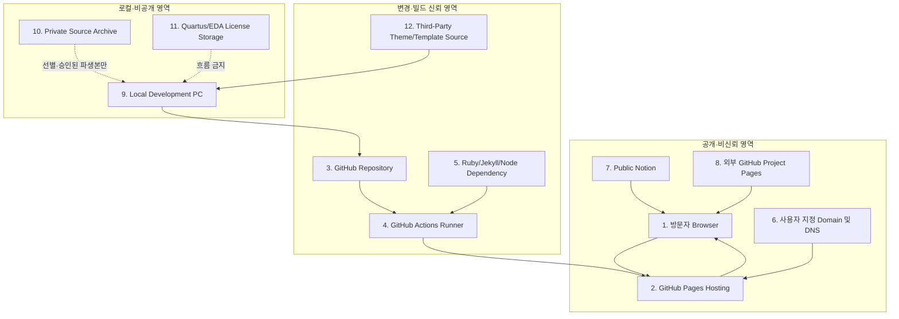

# Trust Boundaries

## 경계 원칙

공개 사이트에 전송된 파일은 비밀로 취급할 수 없다. Repository가 private이어도
Pages로 발행된 산출물은 공개될 수 있으므로, 공개 승인과 빌드 포함 여부를 별도
경계로 관리한다. 직접 asset URL, Git history, Actions artifact, Preview도
메인 내비게이션과 무관하게 접근될 수 있다고 가정한다.

## 경계별 규칙

| ID | 경계 | 신뢰 수준 | 허용 흐름 | 금지 흐름 | Owner | 상태 |
|---|---|---|---|---|---|---|
| TB-01 | 방문자 Browser | 비신뢰 | 정적 GET, HTTPS 외부 링크 | 사용자 HTML, credential, state-changing request | 방문자/사이트 소유자 | 설계 완료 |
| TB-02 | GitHub Pages Hosting | 공개 플랫폼 | 검증된 정적 산출물 제공 | 비밀, 인증, 민감 transaction | GitHub/사이트 소유자 | BLOCKED — 사이트 없음 |
| TB-03 | GitHub Repository | 변경 통제 필요 | 승인된 소스·문서·sanitized asset | token, license, raw PII, private archive | 사이트 소유자 | BLOCKED — 저장소 없음 |
| TB-04 | GitHub Actions Runner | 일시적·권한 보유 | 최소 권한 build/scan/deploy | 장기 secret, self-hosted public runner, 비신뢰 privileged checkout | GitHub/사이트 소유자 | BLOCKED |
| TB-05 | Ruby/Jekyll/Node Dependency | 외부 공급망 | 잠금·검토된 최소 패키지 | floating version, 무출처 binary, postinstall 남용 | 사이트 소유자/maintainer | BLOCKED |
| TB-06 | 사용자 지정 Domain 및 DNS | 외부 제어면 | 검증된 domain→Pages | dangling DNS, 미검증 domain, 공유 credential | 사이트 소유자/registrar | ACCEPTED — 현재 custom domain 없음 |
| TB-07 | Public Notion | 공개 외부 서비스 | 승인된 공개 문서 HTTPS 링크 | private page 우회 링크, embed script | Notion 계정 소유자 | PLATFORM LIMITATION |
| TB-08 | 외부 GitHub Project Pages | 공개 외부 서비스 | 승인된 HTTPS 링크 | 외부 코드의 본 사이트 origin 실행 | 각 repo owner | PLATFORM LIMITATION |
| TB-09 | Local Development PC | 고신뢰 필요 | 검토된 파일을 작업 사본으로 복사 | 비밀의 repo/build 유입, 원본 직접 변형 | 사용자 | BLOCKED — 설정 미검증 |
| TB-10 | Private Source Archive | 비공개 | 승인·redaction된 파생본만 TB-09로 이동 | archive 자체를 public repo/build로 이동 | 사용자/자료 owner | BLOCKED |
| TB-11 | Quartus·EDA License Storage | Restricted | 라이선스 도구가 로컬에서만 사용 | repo, Actions, Pages, log, screenshot 포함 | 사용자/발급기관 | BLOCKED — 보관 통제 미검증 |
| TB-12 | Third-Party Theme·Template Source | 비신뢰 공급망 | 라이선스 확인 후 아이디어/허용 코드만 | 라이선스 불명 코드·asset 복사 | 사이트 소유자/upstream | BLOCKED |

## 경계 통과 체크

Private에서 Public 방향의 모든 파일은 다음을 통과해야 한다.

1. 소유권·라이선스 확인
2. 공개 승인 확인
3. 비밀·개인정보·연구데이터·절대 로컬 경로 검사
4. 이미지 EXIF 및 숨은 metadata 제거
5. 실행 파일·archive·EDA 산출물·source map 제외
6. 최소 크기의 공개용 파생본 생성
7. 빌드 후 `_site`를 별도 재검사

한 단계라도 확인할 수 없으면 `BLOCKED`로 남긴다.

